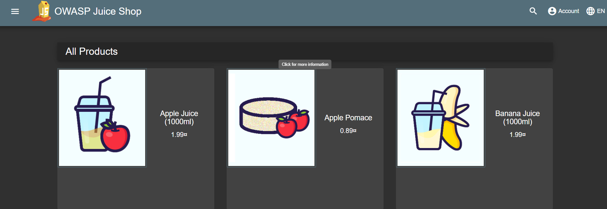
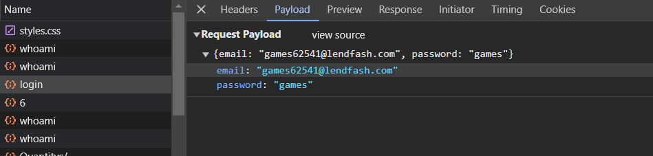
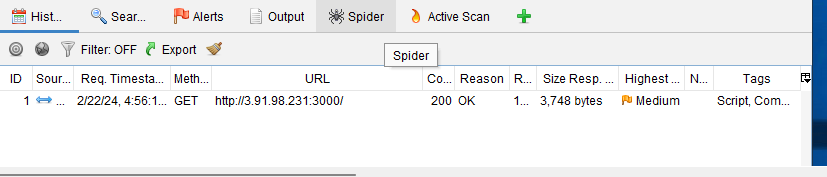
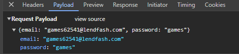
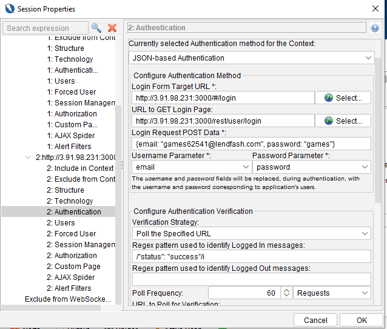
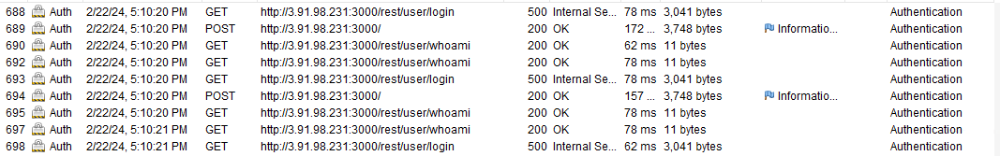
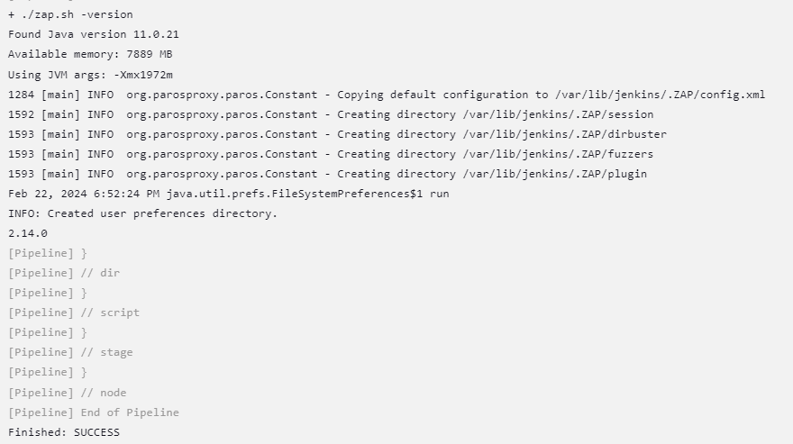
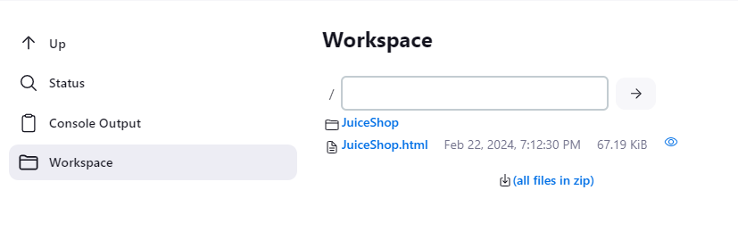

# Generating an automation Plan in ZAP.
 
 In order to generate an automation plan we need to setup the context [ app URL ] and other related details such as URLS to be scanned , authentication factors , logged in Indicators etc.

 In this example we will be trying to authenticate the JuiceShop application using JSON-Based authentication by sending the data as a payload through ZAP
 
 
 

    User registration with Email: games62541@lendfash.com Password : games 

Perform an automated scan for the Juice shop application without creating a context or by establishing the authentication , It will scan the application (mostly the parts which does not require user access ). As we see in the below screenshot No Post request for authentication has been generated 

 

* Steps to generate an automation Plan:

  1) Add the URL to the context , include the URL's which needs to be scanned and can also exclude URL which needs to be omitted for the scan.
  2) set up authentication --> we will be using JSON based authentication as the payload is sent in the JSON format for the above app . we provide certain details like Login form target URL , Request Post data and REGEX used to identify the logged in messages.

        

        

  3) Add a user with the above credentials and select the user as a forced user under the " FORCED USER "  category. Now perform an active scan through the context by selecting the User created. ZAP tries to authenticate the application by the provided user allowing ZAP to scan through the entire application.

        

  4) Now using the automation Option , create an automation Plan - FULL SCAN by selecting the above created context , ZAP provides us a dialog box with steps which could be configured for the plan. Select all the necessary options and run the automation plan. After successful run , we do have an option to export the plan to a YAML file. 

# Installing ZAP in Jenkins server 

In order to install ZAP on Jenkins server we add a repository and Install ZAP manually 

For xUbuntu 20.04 run the following:
    
       echo 'deb http://download.opensuse.org/repositories/home:/cabelo/xUbuntu_20.04/ /' | sudo tee /etc/apt/sources.list.d/home:cabelo.list
       curl -fsSL https://download.opensuse.org/repositories/home:cabelo/xUbuntu_20.04/Release.key | gpg --dearmor | sudo tee /etc/apt/trusted.gpg.d/home_cabelo.gpg > /dev/null
       sudo apt update
       sudo apt install owasp-zap

* we have ZAP installed at this location : /usr/share/owasp-zap/zap.sh on Jenkins server.

        Verfiy ZAP is working:

        /usr/share/owasp-zap$ ./zap.sh -version
                    Found Java version 11.0.21
                    Available memory: 7889 MB
                    Using JVM args: -Xmx1972m
                    2.14.0

Windows Package Manager:

    On Windows systems you can use Windows Package Manager.
    To install: winget install --id=ZAP.ZAP -e
    Updated by the ZAP Team

# Using zap.sh in Jenkins Pipeline 

* Moved the ZAP installation to Jenkins accessible location to be used within the pipeline 

Jenkins Pipeline code to check the version:

    pipeline {
    agent any

    stages {
        stage('Check ZAP version ') {
            steps {
                echo 'Checking ZAP version'
                 script {
                    // Change directory to the ZAP installation path
                    def zapHome = "/var/lib/jenkins/owasp-zap/"
                    dir(zapHome) {
                        // Run ZAP to check the version
                        sh './zap.sh -version'
                         sh './zap.sh -cmd -port 8090 -autorun JuiceShop.yaml || [ $? -ne 1 ] '
                    }
            }
        }
    }
    }
    }

# Generating a Report & Saving to the workspace

